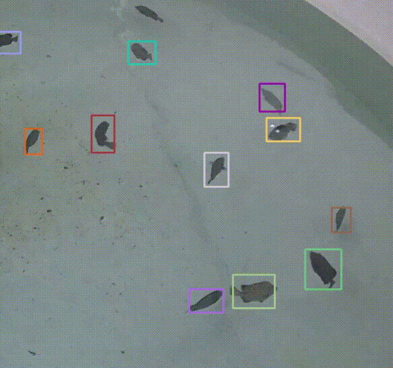
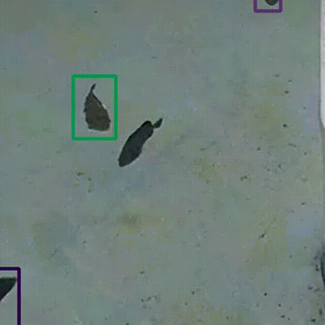

<div align="center">

# When Fish Look Alike: Tracking Identities with Dual-branch Elasticity (TIDE)

**The official implementation of the paper:**
> [**When Fish Look Alike: Tracking Identities with Dual-branch Elasticity**](##TODO:LINK_TO_PAPER##)  
> ***anonymous***
> ### [📄 Paper](##TODO:LINK_TO_PAPER##) | [💻 Code](***anonymous***) | [📊 Datasets](***anonymous***)

</div>

<p align="center">
  
</p>
<p align="center">
  
   
</p>

---

<p align="center">
  For questions, please contact us at <code>**anonymous**</code> or <code>**anonymous**</code>.
</p>


## 🚀 Updates
- **[2026.03]** Updates info not available during **Anonymous** review*

## ✨ Abstract
Tracking fish in dense aquaculture environments poses significant challenges due to minimal inter-individual variance, rapid morphological deformations, and frequent occlusions. Recent state-of-the-art methods push accuracy boundaries by employing heavy Separated Detection and Embedding (SDE) paradigms alongside complex association metrics. However, their exorbitant computational overhead prohibits real-time deployment on edge devices. To bridge the gap between academic benchmarks and resource-constrained industrial deployment, we propose TIDE, a framework for Tracking Identities with Dual-branch Elasticity based on a Joint Detection and Embedding (JDE) paradigm. TIDE offers scalable architectural configurations to flexibly address diverse hardware constraints under a unified design philosophy. Furthermore, we introduce the Adaptive Geometric Correspondence IoU (AGCIoU). This minimalistic association mechanism circumvents the need for computationally expensive re-identification modules and complex morphological metrics. Instead, it leverages robust spatial and geometric cues to effectively maintain identities through severe occlusions with minimal overhead. Extensive evaluations on challenging stress-test datasets demonstrate that TIDE establishes a superior accuracy-efficiency trade-off. Specifically, the framework achieves highly competitive tracking accuracy with a Higher Order Tracking Accuracy (HOTA) score of 28.43 while operating at a remarkably efficient 20.47G FLOPs. This exceptional efficiency represents a 38.7-fold computational reduction compared to standard heavy-backbone MOT trackers, proving its viability for real-world edge deployment.

## 🏆 Key Contributions
*   We propose *TIDE*, a computationally elastic JDE framework. It features scalable deployment configurations to flexibly balance tracking accuracy against specific hardware constraints.
*   We introduce the *Adaptive Geometric Correspondence IoU (AGCIoU)*. As a minimalist alternative to heavy Re-ID networks, it maintains robust identity consistency during severe occlusions using only spatial and geometric cues.
*   We validate TIDE on the specialized *MFT-Edge* stress-test benchmark. The framework achieves a competitive HOTA of 28.43 at just 20.47G FLOPs. This *38.7-fold* computational reduction over standard heavy-backbone trackers proves its viability for industrial edge deployment.

## 📊 Tracking Performance

### State-of-the-Art Comparison on MFT-Edge Dataset

| Method                 | Params ↓   | FLOPs ↓   | HOTA ↑   | IDF1 ↑   | MOTA ↑   | IDs ↓   |
|------------------------|------------|-----------|----------|----------|----------|---------|
| SORT†                  | 99.00M     | 793.21G   | 22.73    | 23.91    | 48.67    | 2599    |
| ByteTrack†             | 99.00M     | 793.21G   | 19.18    | 19.37    | 40.17    | 2325    |
| OC-SORT†               | 99.00M     | 793.21G   | 22.99    | 24.14    | 48.44    | 2674    |
| FairMOT                | 16.55M     | 72.93G    | 27.26    | 29.68    | 60.74    | 2456    |
| CMFTNet                | 45.08M     | 137.77G   | 27.08    | 29.93    | **61.90**| 2716    |
| TrackFormer            | 42.95M     | 143.43G   | 26.51    | 26.73    | 43.42    | 899     |
| **TIDE-L (Ours)**      | **5.79M**  | **20.47G**| 28.43    | 36.29    | 47.84    | 574     |
| **TIDE-S (Ours)**      | 32.59M     | 90.13G    | **29.98**| **39.01**| 54.74    | 908     |

<details>
<summary><b>Click to see the full comparison table</b></summary>

| **Methods**           | **Params ↓** | **FLOPs ↓** | **HOTA ↑** | **IDF1 ↑** | **IDP ↑** | **IDR ↑** | **DetRe ↑** | **DetPr ↑** | **IDs ↓** | **MOTA ↑** | **MOTP ↑** |
|-----------------------|--------------|-------------|------------|------------|-----------|-----------|-------------|-------------|-----------|------------|------------|
| SORT†                 | 99.00M       | 793.21G     | 22.73      | 23.91      | 29.09     | 20.29     | 44.66       | 64.03       | 2599      | 48.67      | 72.01      |
| ByteTrack†            | 99.00M       | 793.21G     | 19.18      | 19.37      | 26.11     | 15.40     | 35.66       | 60.46       | 2325      | 40.17      | 67.99      |
| OC-SORT†              | 99.00M       | 793.21G     | 22.99      | 24.14      | 29.28     | 20.54     | 44.84       | 63.92       | 2674      | 48.44      | 72.17      |
| HybridSORT†           | 99.00M       | 793.21G     | 15.89      | 17.29      | **56.77** | 10.20     | 11.79       | 65.58       | **214**   | 14.23      | 71.64      |
| QDTrack               | 57.20M       | 32.02G      | 25.27      | 24.49      | 27.74     | 21.93     | **53.70**   | 67.92       | 9103      | 42.81      | 75.34      |
| FairMOT               | 16.55M       | 72.93G      | 27.26      | 29.68      | 36.56     | 24.98     | 46.71       | **68.36**   | 2456      | 60.74      | 69.59      |
| CMFTNet               | 45.08M       | 137.77G     | 27.08      | 29.93      | 36.35     | 25.43     | 47.52       | 67.93       | 2716      | **61.90**  | 69.47      |
| TrackFormer           | 42.95M       | 143.43G     | 26.51      | 26.73      | 35.69     | 21.36     | 42.04       | 70.23       | 899       | 43.42      | **76.00**  |
| CenterTrack           | 16.67M       | 61.36G      | 22.49      | 23.39      | 30.90     | 18.81     | 35.11       | 57.67       | 1032      | 26.68      | 68.48      |
| TransCenter           | 30.66M       | 133.09G     | 27.20      | 29.48      | 37.05     | 24.48     | 38.22       | 57.85       | 597       | 24.69      | 73.83      |
| TFMFT                 | 39.93M       | 215.27G     | 21.88      | 26.74      | 45.55     | 18.92     | 29.72       | 71.54       | 945       | 35.65      | 74.89      |
| **TIDE-L (Ours)**     | **5.79M**    | **20.47G**  | 28.43      | 36.29      | 49.44     | 28.67     | 37.34       | 64.41       | 574       | 47.84      | 67.17      |
| **TIDE-S (Ours)**     | 32.59M       | 90.13G      | **29.98**  | **39.01**  | 47.87     | **32.92** | 42.86       | 62.32       | 908       | 54.74      | 65.82      |

</details>

*Notes: † indicates SDE-based methods using shared weights. -S/-L denote the Scalable and Lightweight branches of TIDE, respectively.*

## 🔧 Installation

+ **Step.1** Clone this repo.
+ **Step.2** Install dependencies. We use **python=3.8**.
   ```
   cd {Repo_ROOT}
   conda env create -f requirements.yaml
   conda activate TIDE
   ```

## Exps.
* Download *MFT_Edge* or utilize your datasets for test.

  ```
  sh experiments/exp.sh
  ```

## 📦 Pretrained Models
Our pretrained models can be downloaded from: *Links are not available during **Anonymous** review*

## 📦 Datasets
*MFT_Edge* can be downloaded from: *Links are not available during **Anonymous** review*


## 🙏 Acknowledgements
*Acknowledgements are Not available during **Anonymous** review*

## 📜 Citation
*Citation are Not available during **Anonymous** review*