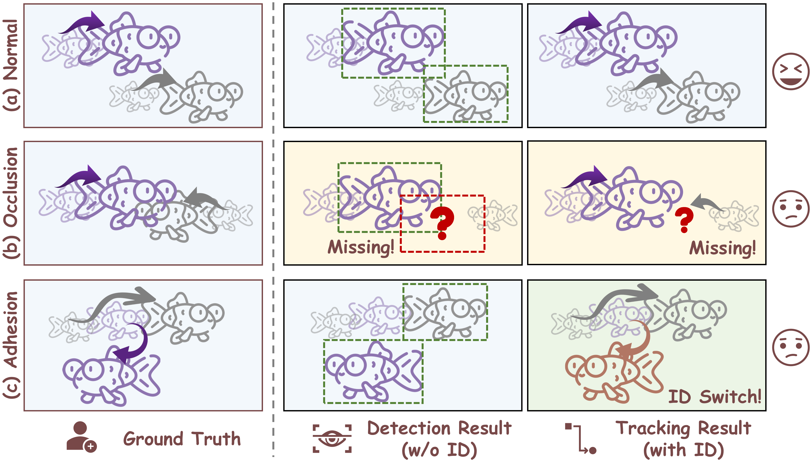

<div align="center">

# When Fish Look Alike: Tracking Identities with Dual-branch Elasticity

The official implementation of the paper：
>  [**When Fish Look Alike: Tracking Identities with Dual-branch Elasticity**](https://vranlee.github.io/TIDE/)  
>  Vran Lee, Xin Liu, Yijie Wei, Yeqiang Liu, Hwa Liang Leo, Zhenbo Li*
>  [**\[Project\]**](https://vranlee.github.io/TIDE/) [**\[Paper\]**](http://arxiv.org/abs/2607.26412) [**\[Code\]**](https://github.com/vranlee/TIDE)

</div>

<p align="center">
  
</p>
<p align="center">
  
   
</p>

---

<p align="center">
  
> Contact: vranlee86@gmail.com. Any questions or discussion are welcome!
> 
> If like this work, a star 🌟 would be much appreciated!

-----
</p>


## 🚀 Updates
- **[2026.07]** Updates Repo.

## 🏆 Key Contributions
*   **Dual-Branch Elastic Framework**: We propose *TIDE*, a highly efficient JDE framework that effectively resolves the computational bottlenecks of tracking dense, homogeneous targets. It provides a scalable dual-branch design to accommodate diverse hardware constraints.
*   **Minimalist Geometric Association**: We introduce *AGCIoU*, a geometric association metric that maintains robust ID consistency under severe non-rigid deformations and occlusions, completely avoiding the substantial overhead of heavy appearance models.
*   **Superior Accuracy-Efficiency Balance**: Extensive evaluations demonstrate the framework's exceptional accuracy-efficiency trade-off on the MFT-Edge benchmark. The lightweight *TIDE-L* achieves a competitive HOTA of 28.43 while reducing computational cost by 38.7-fold compared to standard heavy trackers, directly proving its viability for industrial edge deployment.

## 📊 Tracking Performance

### State-of-the-Art Comparison on MFT-Edge Dataset

| Method | Params ↓ | FLOPs ↓ | HOTA ↑ | IDF1 ↑ | MOTA ↑ | IDs ↓ |
|------------------------|------------|-----------|----------|----------|----------|---------|
| SORT | 99.00M | 793.21G | 22.73 | 23.91 | 48.67 | 2599 |
| ByteTrack | 99.00M | 793.21G | 19.18 | 19.37 | 40.17 | 2325 |
| OC-SORT | 99.00M | 793.21G | 22.99 | 24.14 | 48.44 | 2674 |
| FairMOT | 16.55M | 72.93G | 27.26 | 29.68 | 60.74 | 2456 |
| CMFTNet | 45.08M | 137.77G | 27.08 | 29.93 | 61.90 | 2716 |
| TrackFormer | 42.95M | 143.43G | 26.51 | 26.73 | 43.42 | 899 |
| SU-T | 99.00M | 793.21G | **34.41**| **40.50**| **68.52**| 1902 |
| **TIDE-L (Ours)** | **5.79M** | **20.47G**| 28.43 | 36.29 | 47.84 | 574 |
| **TIDE-S (Ours)** | 32.59M | 90.13G | 29.98 | 39.01 | 54.74 | 908 |

<details>
<summary><b>Click to see the full comparison table</b></summary>

*Note: The best results are highlighted in **bold**, and the second-best results are <u>underlined</u>.*

| **Methods** | **Params ↓** | **FLOPs ↓** | **HOTA ↑** | **IDF1 ↑** | **IDP ↑** | **IDR ↑** | **DetRe ↑** | **DetPr ↑** | **IDs ↓** | **MOTA ↑** | **MOTP ↑** |
|-----------------------|--------------|-------------|------------|------------|-----------|-----------|-------------|-------------|-----------|------------|------------|
| SORT | 99.00M | 793.21G | 22.73 | 23.91 | 29.09 | 20.29 | 44.66 | 64.03 | 2599 | 48.67 | 72.01 |
| ByteTrack | 99.00M | 793.21G | 19.18 | 19.37 | 26.11 | 15.40 | 35.66 | 60.46 | 2325 | 40.17 | 67.99 |
| OC-SORT | 99.00M | 793.21G | 22.99 | 24.14 | 29.28 | 20.54 | 44.84 | 63.92 | 2674 | 48.44 | 72.17 |
| HybridSORT | 99.00M | 793.21G | 15.89 | 17.29 | **56.77** | 10.20 | 11.79 | 65.58 | **214** | 14.23 | 71.64 |
| QDTrack | 57.20M | <u>32.02G</u> | 25.27 | 24.49 | 27.74 | 21.93 | <u>53.70</u> | 67.92 | 9103 | 42.81 | <u>75.34</u> |
| FairMOT | <u>16.55M</u> | 72.93G | 27.26 | 29.68 | 36.56 | 24.98 | 46.71 | 68.36 | 2456 | 60.74 | 69.59 |
| CMFTNet | 45.08M | 137.77G | 27.08 | 29.93 | 36.35 | 25.43 | 47.52 | 67.93 | 2716 | <u>61.90</u> | 69.47 |
| TrackFormer | 42.95M | 143.43G | 26.51 | 26.73 | 35.69 | 21.36 | 42.04 | <u>70.23</u> | 899 | 43.42 | **76.00** |
| CenterTrack | 16.67M | 61.36G | 22.49 | 23.39 | 30.90 | 18.81 | 35.11 | 57.67 | 1032 | 26.68 | 68.48 |
| TransCenter | 30.66M | 133.09G | 27.20 | 29.48 | 37.05 | 24.48 | 38.22 | 57.85 | 597 | 24.69 | 73.83 |
| TFMFT | 39.93M | 215.27G | 21.88 | 26.74 | 45.55 | 18.92 | 29.72 | **71.54** | 945 | 35.65 | 74.89 |
| SU-T | 99.00M | 793.21G | **34.41** | **40.50** | 37.97 | **43.41** | **67.45** | 59.00 | 1902 | **68.52** | 71.81 |
| **TIDE-L (Ours)** | **5.79M** | **20.47G** | 28.43 | 36.29 | <u>49.44</u> | 28.67 | 37.34 | 64.41 | <u>574</u> | 47.84 | 67.17 |
| *$\Delta$ vs. SU-T* | *-94.1%* | *-97.4%* | *-17.4%* | *-10.4%* | *+30.2%* | *-33.9%* | *-44.6%* | *+9.2%* | *-69.8%* | *-30.2%* | *-6.5%* |
| **TIDE-S (Ours)** | 32.59M | 90.13G | <u>29.98</u> | <u>39.01</u> | 47.87 | <u>32.92</u> | 42.86 | 62.32 | 908 | 54.74 | 65.82 |
| *$\Delta$ vs. SU-T* | *-67.1%* | *-88.6%* | *-12.9%* | *-3.7%* | *+26.1%* | *-24.2%* | *-36.5%* | *+5.6%* | *-52.3%* | *-20.1%* | *-8.3%* |

</details>

## 🧐 Prerequisites
- CUDA >= 11.0
- Python >= 3.8
- PyTorch >= 1.7.0
- Ubuntu 18.04 or later (Windows is also supported but may require additional setup)

## 🔧 Installation

+ **Step.1** Clone this repo.
+ **Step.2** Install dependencies. We use **python=3.8**.
   ```
   cd {Repo_ROOT}
   conda env create -f requirements.yaml
   conda activate TIDE
   ```
+ **Step.3** Perparing datasets.

  e.g. Download [MFT_Edge](https://pan.baidu.com/s/1o1tBsusM9VxSxmz--IzldQ?pwd=wfeq) for test (utilize [MFT25](https://vranlee.github.io/SU-T/) or your own datasets as well.)
  
## 🏋️ Training Sample
  ```python
  python train.py cmot \
  --exp_id YOUR-EXP-NAMES --data_cfg '../src/lib/cfg/mft_edge.json' \
  --lr 5e-4 --batch_size 16 --wh_weight 0.5 \
  --arch 'tides/tidel' --num_epochs 30 --reid_dim 64
  ```


## 🧪 Testing Sample
  ```python
  python track.py cmot \
  --val_MFT_Edge True \
  --data_dir /DATASETS/MFT \
  --load_model ../exp/cmot/YOUR-EXP-NAMES/model_best.pth \
  --arch 'tides/tidel' \ 
  --conf_thres 0.4
  ```

## 🔗 Pretrained Models
Our [pretrained models](https://pan.baidu.com/s/10yF69NL-A_uOCsu_prcMzw?pwd=v57h) can be downloaded from: [**[BaiduYun: v57h]**](https://pan.baidu.com/s/10yF69NL-A_uOCsu_prcMzw?pwd=v57h)

## 🔗 Datasets
[MFT_Edge](https://pan.baidu.com/s/1o1tBsusM9VxSxmz--IzldQ?pwd=wfeq) dataset can be downloaded from: [**[BaiduYun: wfeq]**](https://pan.baidu.com/s/1o1tBsusM9VxSxmz--IzldQ?pwd=wfeq)


## 🙏 Acknowledgements
A large part of the code is borrowed from [sompt22](https://github.com/sompt22/CountingMOT), [apple](https://github.com/apple/ml-fastvit), and [ultralytics](https://github.com/ultralytics/ultralytics). Thanks for their wonderful works!

## 📜 Citation
```bibtex
@misc{lee2026fishlookaliketracking,
      title={When Fish Look Alike: Tracking Identities with Dual-branch Elasticity}, 
      author={Vran Lee and Xin Liu and Yijie Wei and Yeqiang Liu and Hwa Liang Leo and Zhenbo Li},
      year={2026},
      eprint={2607.26412},
      archivePrefix={arXiv},
      primaryClass={cs.CV},
      url={https://arxiv.org/abs/2607.26412}, 
}
```
